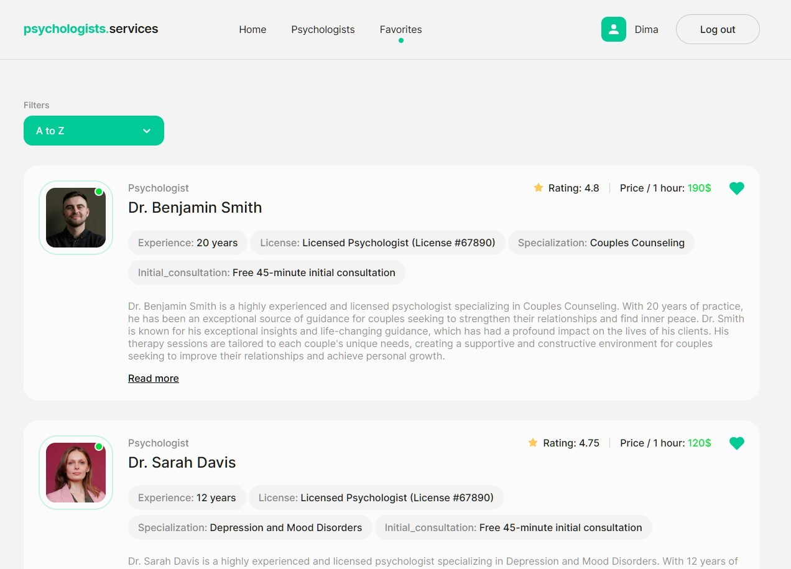

# Psychologists Services

This application helps users locate psychological services and resources.

## Features

- Resourceful links to additional support
- Search functionality

## Screenshots

### Home Page


### Psychologists Page


### Favorites Page



## Getting Started

### Prerequisites

Ensure you have the following installed:

- Web browser (e.g., Chrome, Firefox)

### Installation

Clone the repository:

```bash
git clone https://github.com/sign-maker/psychologists-services.git
cd psychologists-services


npm install
npm run dev
```
